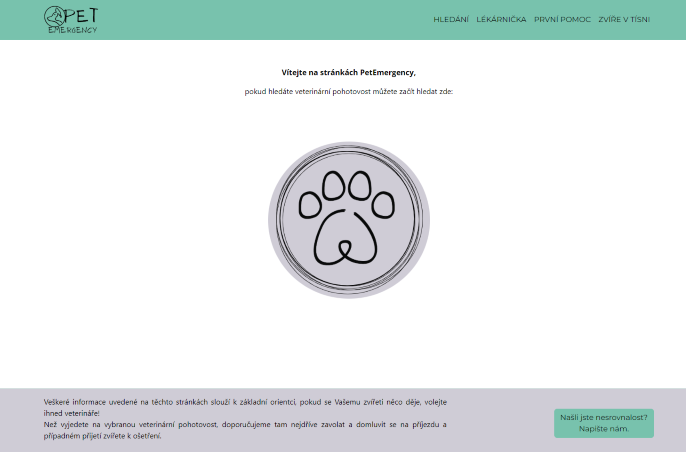
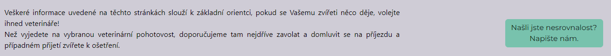
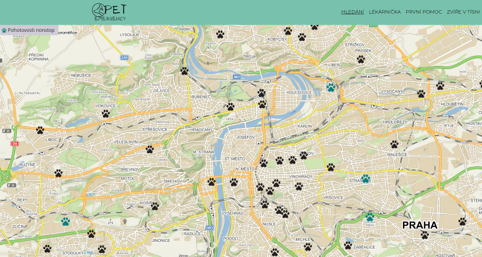
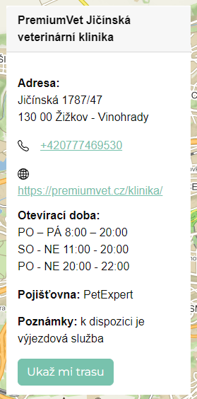

# Pet Emergency
Cílem projektu Pet Emergency je vytvořit přehled veterinárních pohotovostí pro majitele domácích mazlíčků a majitelům poskytnout další užitečné informace. Pet Emergency reaguje na absenci takového projektu.

## Jak postupovat

Najdete zde možnost vybírat z menu v horní části stránky. V menu najdete doporučení ohledně lékárničky, první pomoci a najdete-li zvíře ve volné přírodě.

Ve spodní části stránky se nachází doplňující informace k provozu stránek a možnost zaslat nám e-mail s podněty nebo nesrovnalostmi.

Kliknutím na ikonu uprostřed stránky, je zobrazena mapa. 

Po klinutí jste vyzváni k povolení nebo odmítnutí Vaší polohy. Když odmítnete sdílet polohu, zobrazí se Vám mapa Prahy, odtud už musíte vyhledávat sami ručně. Povolíte-li přístup k poloze zobrazí se na mapě místo dle Vaší aktuální polohy. Barevně odlišené tlapičky jsou vetrinární ordinace, rozdělené podle typu pohotovosti. Vysvětlivku najdete v levé horním rohu mapy.

Klikem na ikonu (tlapička) si zobrazíte bližší informace o veterinární ordinaci a ukázání detailu místa na mapě.

## Zdroje k vytvoření aplikace
K vytvoření této aplikace jsme využili React, Mapy API a React Bootstrap.
